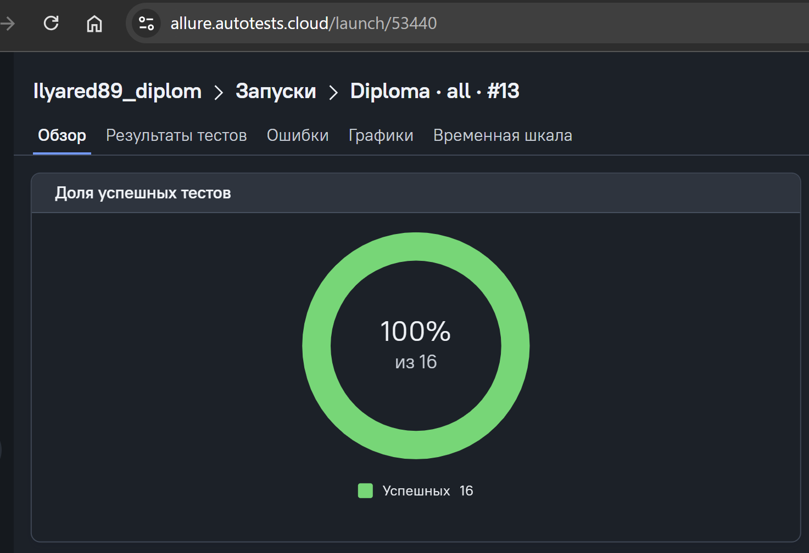
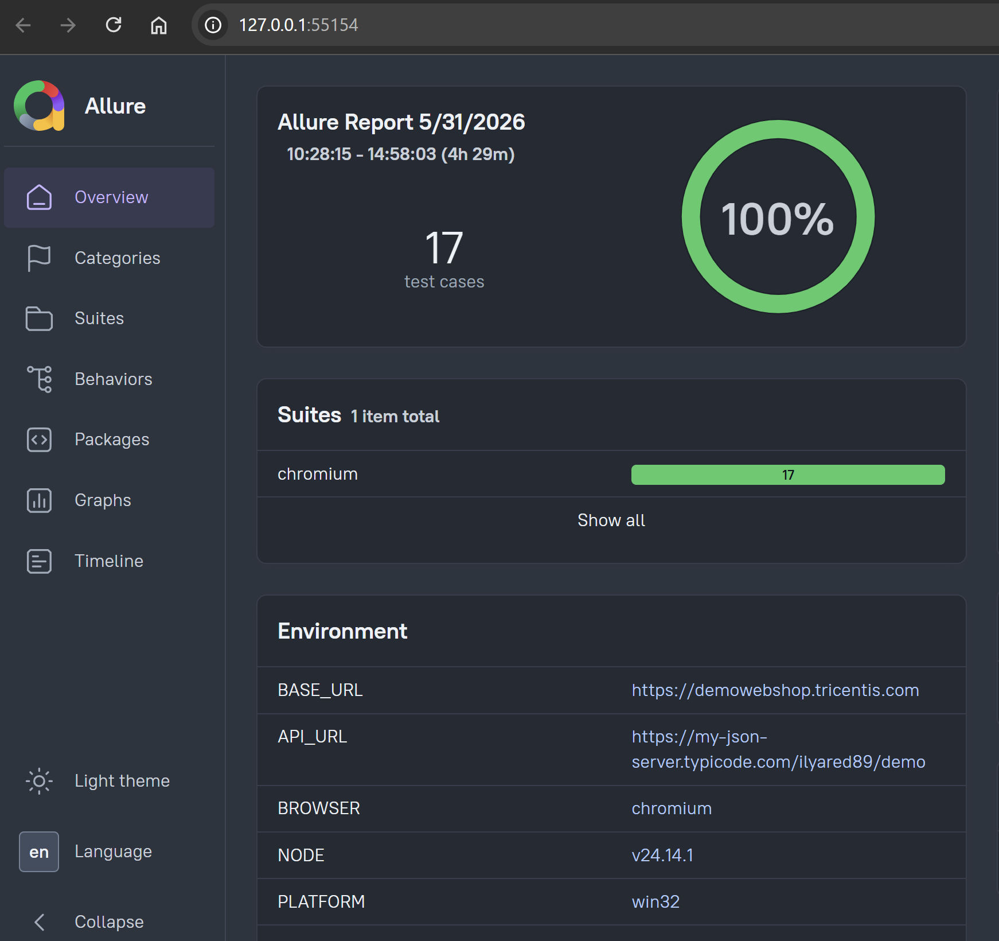
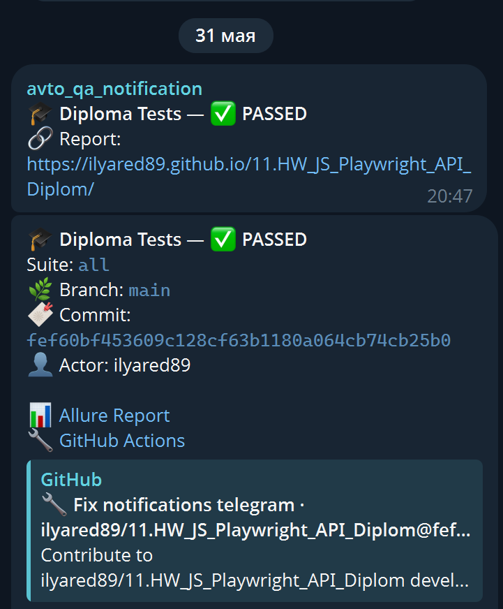

# 🎓 Дипломный проект: QA Automation на Playwright

[](https://github.com/ilyared89/11.HW_JS_Playwright_API_Diplom/actions/workflows/ci.yml)
[](https://ilyared89.github.io/11.HW_JS_Playwright_API_Diplom/)
[](https://allure.autotests.cloud/)
[](https://t.me/)

## 🎯 Цель проекта

Демонстрация навыков автоматизации тестирования, полученных в рамках курса:

- **UI автоматизация** — 5 функциональных тестов с Page Object, генератором данных и кастомными ассертами
- **API автоматизация** — 5 функциональных тестов с Service Layer, генератором данных и кастомными ассертами
- **CI/CD** — запуск в GitHub Actions и Jenkins с уведомлениями в Telegram
- **Reporting** — Allure Report с историей в GitHub Pages + Allure TestOps

## 🧰 Технологический стек

| Категория        | Инструмент                                                         |
| ---------------- | ------------------------------------------------------------------ |
| Язык             | JavaScript (ES Modules)                                            |
| Фреймворк        | Playwright                                                         |
| UI сайт          | [demowebshop.tricentis.com](https://demowebshop.tricentis.com)     |
| API сайт         | [my-json-server.typicode.com](https://my-json-server.typicode.com) |
| Паттерны         | Page Object, Service Layer, Builder                                |
| Генерация данных | @faker-js/faker                                                    |
| Отчётность       | Allure Report, Allure TestOps                                      |
| CI/CD            | GitHub Actions, Jenkins                                            |
| Уведомления      | Telegram Bot                                                       |

## 🚀 Быстрый старт

### Установка

```bash
# Клонирование репозитория
git clone https://github.com/ilyared89/11.HW_JS_Playwright_API_Diplom.git
cd 11.HW_JS_Playwright_API_Diplom

npm install


# Установка зависимостей
npm ci

# Установка браузеров Playwright
npx playwright install chromium
```

### Убить все node процессы (powerShell с правами Admin)
```bash
taskkill /F /IM node.exe
```

### Запуск тестов

```bash
# Все тесты
npm test

# Только UI тесты
npm run test:ui

# Только API тесты
npm run test:api

# Только Smoke тесты
npm run test:smoke

# С генерацией отчёта и уведомлением
npm run test:notify
```

### Отчёты

```bash
# Генерация Allure Report
npm run allure:generate

# Открытие отчёта
npm run allure:open

# Serve режим
npm run allure:serve
```

## 📁 Структура проекта

```
.
├── src/
│   ├── pages/              # Page Objects (UI)
│   │   ├── base.page.js
│   │   ├── login.page.js
│   │   ├── register.page.js
│   │   ├── home.page.js
│   │   ├── product.page.js
│   │   └── cart.page.js
│   ├── services/           # Service Layer (API)
│   │   ├── api.service.js
│   │   ├── posts.service.js
│   │   └── comments.service.js
│   ├── helpers/
│   │   ├── builders/       # Генераторы данных
│   │   │   ├── user.builder.js
│   │   │   ├── post.builder.js
│   │   │   └── comment.builder.js
│   │   └── fixtures/       # Playwright fixtures
│   │       ├── ui.fixture.js
│   │       └── api.fixture.js
├── tests/
│   ├── ui/                 # 5 UI тестов
│   │   ├── login.test.js
│   │   ├── register.test.js
│   │   ├── search.test.js
│   │   ├── cart.test.js
│   │   └── newsletter.test.js
│   └── api/                # 5 API тестов
│       ├── posts.test.js
│       ├── posts-get.test.js
│       ├── posts-update.test.js
│       ├── posts-delete.test.js
│       └── comments.test.js
├── allure/
│   └── categories.json
├── notifications/
│   └── telegram.json
├── .github/workflows/
│   └── ci.yml
├── Jenkinsfile
├── playwright.config.js
├── package.json
└── README.md
```

## 🧪 UI Тесты (demowebshop.tricentis.com)

| Тест                | Описание                           | Теги                     |
| ------------------- | ---------------------------------- | ------------------------ |
| Login — valid       | Успешный логин с валидными кредами | @SMOKE, @UI, @AUTH       |
| Login — invalid     | Ошибка при невалидных кредах       | @UI, @AUTH               |
| Register — valid    | Регистрация с данными от Faker     | @SMOKE, @UI, @AUTH       |
| Register — mismatch | Ошибка при несовпадении паролей    | @UI, @AUTH               |
| Search — results    | Поиск товара по названию           | @SMOKE, @UI, @SEARCH     |
| Search — no results | Поиск несуществующего товара       | @UI, @SEARCH             |
| Cart — add/remove   | Добавление и удаление из корзины   | @SMOKE, @UI, @CART       |
| Newsletter          | Подписка на рассылку               | @SMOKE, @UI, @NEWSLETTER |

## 🌐 API Тесты (my-json-server.typicode.com)

| Тест              | Описание                     | Теги                          |
| ----------------- | ---------------------------- | ----------------------------- |
| Posts — create    | Создание поста (POST)        | @SMOKE, @API, @POSTS, @POST   |
| Posts — get all   | Получение всех постов (GET)  | @SMOKE, @API, @POSTS, @GET    |
| Posts — get one   | Получение одного поста (GET) | @API, @POSTS, @GET            |
| Posts — update    | Полное обновление (PUT)      | @SMOKE, @API, @POSTS, @PUT    |
| Posts — patch     | Частичное обновление (PATCH) | @API, @POSTS, @PATCH          |
| Posts — delete    | Удаление поста (DELETE)      | @SMOKE, @API, @POSTS, @DELETE |
| Comments — get    | Получение комментариев поста | @SMOKE, @API, @COMMENTS, @GET |
| Comments — create | Создание комментария         | @API, @COMMENTS, @POST        |

## 🔗 Полезные ссылки

| Ресурс                       | Ссылка                                                      |
| ---------------------------- | ----------------------------------------------------------- |
| Allure Report (GitHub Pages) | https://ilyared89.github.io/11.HW_JS_Playwright_API_Diplom/ |
| Allure TestOps               | https://allure.autotests.cloud/                             |
| Jenkins                      | https://jenkins.autotests.cloud/                            |
| UI тестируемый сайт          | https://demowebshop.tricentis.com                           |
| API тестируемый сайт         | https://my-json-server.typicode.com                         |

## 🏗️ CI/CD

### GitHub Actions

- Автозапуск при `push`/`pull_request` в `main`
- Ручной запуск с выбором suite (all/ui/api)
- Генерация Allure Report с историей на GitHub Pages
- Уведомления в Telegram со ссылками на отчёт и Actions
- Загрузка результатов в Allure TestOps

## 📝 Allure TestOps

- Результаты загружаются через `allurectl`
- 🔧 Allure TestOps
- [Ссыла на отчет](https://allure.autotests.cloud/project/5227/launches)
  
- 📊 Allure Report
  
- Интеграция с GitHub для отслеживания коммитов
- Тест-кейсы синхронизируются автоматически

## 📝 Telegram notifications

- 

---

**Автор:** [ilyared89](https://github.com/ilyared89)
